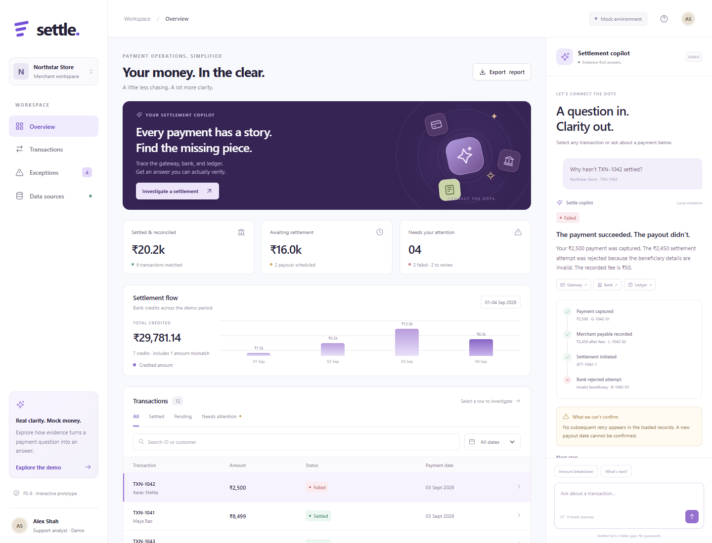

# SettleAI

An evidence-driven settlement support frontend, branded **Settle**, built for PS-8.

Open `index.html` in a modern browser. No installation, API key, database, or build step is required. Keep `styles.css` and `app.js` alongside the HTML file.

## Included

- Responsive overview dashboard with twelve synthetic transactions.
- Search by transaction ID or customer and filter by payment date and status.
- Exceptions queue for failed payouts, missing bank outcomes, and amount mismatches.
- Local copilot responses, follow-up prompts, timelines, and source evidence.
- Export the filtered report as CSV or an individual investigation as JSON.
- Data sources page with downloadable gateway, bank, and ledger CSVs.
- Keyboard-accessible navigation, dialogs, reduced-motion support, and mobile layout.

## Demo scenarios

| Transaction | Scenario |
| --- | --- |
| TXN-1042 | Captured payment, bank rejection, no known retry |
| TXN-1041 | Failed first attempt followed by successful bank credit |
| TXN-1044 | Scheduled future settlement |
| TXN-1046 | Gateway initiation with missing bank outcome |
| TXN-1048 | Rejected payout to a closed account |
| TXN-1050 | Bank credit differs from expected payable by ₹200 |

All amounts are derived from integer paise. The fixtures use a synthetic 2% fee deduction and do not model real provider fee or tax rules. Snapshot time is fixed at 04 September 2026, 18:00 IST. Summary cards and the chart describe the full fixture period; list filters apply to the transaction table and its export. The chart includes a bank credit whose amount needs review, while the settled metric only includes fully reconciled transactions.

## Prototype boundary

This is a frontend demonstration. Copilot responses are generated using deterministic JavaScript rules and templates, not an LLM. There are no network calls, live integrations, credentials, authentication, merchant authorization, or MongoDB connection. The analyst identity and merchant workspace are illustrative. All bundled data can be inspected by anyone opening the page.

Do not place real financial data or API secrets in frontend files. For a live application, move retrieval and reconciliation to a backend that authenticates users, enforces merchant scope, and exposes bounded read-only investigation tools. Keep exact money arithmetic in that backend and pass verified findings to the explanation model.

## Files

- `index.html` — semantic interface and layout
- `styles.css` — responsive styling
- `app.js` — synthetic records, reconciliation rules, and interactions

The project uses system fonts and inline SVG icons, with no third-party runtime dependencies.
